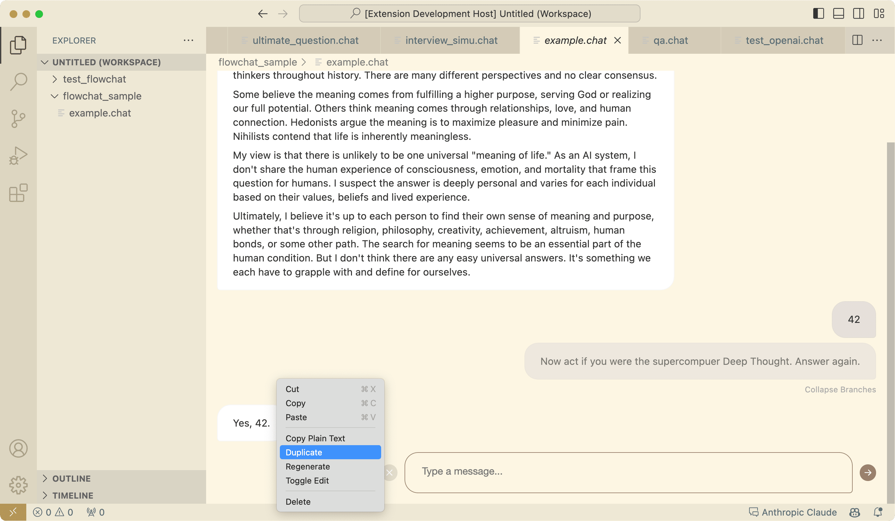
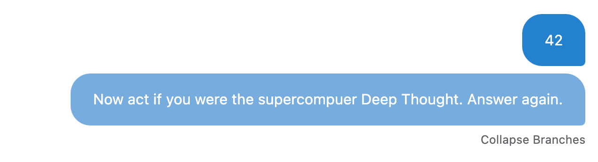
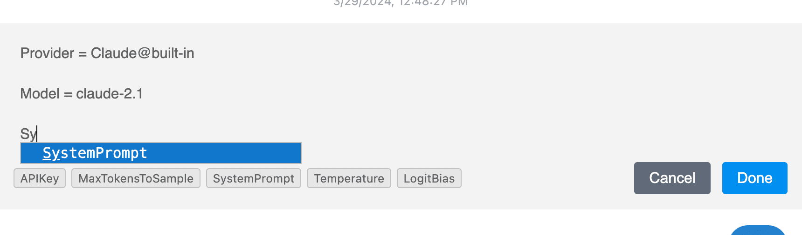

# ICE - Integrated Conversational Environment

ICE (Integrated Conversational Environment) is a flexible, easy-to-use VSCode extension that allows users to experiment with conversational AI using various large language models (LLMs). With ICE, you can easily chat with LLMs, manage conversation histories, and even create custom LLM integrations.

> ❓ **Wondering how to use?** 
>
> Check out the [Basic Usage](#basic-usage) section below.

## Table of Contents

- [Features](#features)
- [Basic Usage](#basic-usage)
  - [Instant Chat](#instant-chat)
  - [Managing Chat Sessions as .chat Files](#managing-chat-sessions-as-chat-files)
- [Advanced Chat Features](#advanced-chat-features)
  - [Forking Conversations](#forking-conversations)
  - [Editing Messages](#editing-messages)
  - [Inline Configuration Editing](#inline-configuration-editing)
  - [Message Snippets](#message-snippets)
- [Requirements](#requirements)
- [Extension Settings](#extension-settings)
- [Creating Custom Providers](#creating-custom-providers)
- [Known Issues](#known-issues)
- [Planned Enhancements](#planned-enhancements)
- [Release Notes](#release-notes)
- [Contributing](#contributing)

## Features

- Chat with built-in LLM providers (API keys required):
  - OpenAI
  - Anthropic
  - Google
  - ZHIPU AI
  - Poe
- Persist chat histories as `.chat` files (YAML format) 
  - Easily manage and share conversations
  - Add chat histories to version control
- Fork conversations to explore different paths
  - Edit both user and LLM messages
  - Resend/regenerate
  - Inline configuration editing and switching
  - Changes are saved to the `.chat` file
- Attachments support for multimodal models
- Message snippets for quickly inserting prompts
- Instant Chat feature for quickly chatting with LLMs
- Create custom LLM providers using JavaScript
- Configure API keys and settings for built-in providers

## Basic Usage

### Instant Chat

1. Open Command Palette (`Ctrl+Shift+P` or `Cmd+Shift+P` on macOS)
2. Type "Instant Chat" (you don't have to type the whole thing, it should autocomplete)
3. If the "ICE: Instant Chat" command is highlighted, press `Enter`
4. You can now select a chat provider and start chatting! (API keys required)

**Note:** You can continue a previous Instant Chat session by running "ICE: Continue Last Instant Chat" from the Command Palette.

If you've enabled the `Use Previous Provider For New Chat` setting, ICE will automatically select your previously used provider when starting a new chat.

### Managing Chat Sessions as `.chat` Files

1. Create a new file with a `.chat` extension (e.g., `my_conversation.chat`)
2. Open the file
3. Select a chat provider to start (API keys required)

## Advanced Chat Features

### Forking Conversations

Right-click on a message, then select "Duplicate" to create a fork of the conversation. You can then edit the messages and continue the conversation from that point.

You can switch between branches by clicking "Branches" below a message, then selecting the desired branch.

> **Tip:** The "Resend" and "Regenerate" options will also fork the conversation.

### Editing Messages

Right-click on a message, then select "Edit" to modify the message. You can change both user and LLM messages.

### Inline Configuration Editing

ICE provides a convenient way to edit chat provider configurations or switch between providers at different stages within a single conversation. For example, you can combine and utilize the strengths of different LLMs, such as GPT, Claude, and Gemini, seamlessly in one chat session.

Selecting a chat provider from the right side of the VSCode status bar will create a configuration card in the chat view. You can edit the configuration values by right-clicking on the card and selecting "Edit".

Inline configuration editing applies to messages after the card.

You can also right-click on any message and select "Insert Configuration" to quickly add a configuration card to the chat view.

Autocompletion is available for configuration keys, and forking is supported for configuration changes.

### Message Snippets

Often, you may find yourself typing the same prompts repeatedly. ICE provides a message snippet feature to help you quickly insert frequently used prompts.

When typing a message, you can select parts of the text and right-click on the selection to "Create Snippet". You will be prompted to enter a quick completion text for the snippet.

When typing a message, you can enter `/YourSnippetName` to insert the snippet.

Right-click on a message editor and select "Manage Snippets" to view, edit, and delete snippets.

## Requirements

To use ICE with the built-in LLM providers, you'll need to provide your own API keys. When you send your first message, ICE will prompt you to enter the necessary configuration details.

## Extension Settings & Provider Configuration

You can view and edit **provider-specific settings** by clicking the provider name in the VSCode status bar and selecting "Configure". Provider code can also be opened from this menu.

Additionally, ICE provides several **extension configuration options**:

* `Instant Chat Session Folder`: Specify a custom folder to store Instant Chat sessions. Leave empty to use the default location.
* `Use Previous Provider For New Chat`: When checked, ICE will automatically select the previously used provider when starting a new chat.

You can access these settings through VSCode's settings interface.

## Creating Custom Providers

ICE supports custom LLM providers written in JavaScript. Provider scripts use a format similar to Tampermonkey to declare configuration entries. 

> Take a look at the [Built-in Providers](https://github.com/richardhyy/ice-vscode/tree/main/providers) for examples.

## Known Issues

As ICE is in early development, you may encounter bugs or instability. If you experience any issues, please file a report on the GitHub repository. Pull requests are also welcome!

## Planned Enhancements

- [ ] Rendering performance optimizations
- [ ] Search, tagging, and filtering of chat histories
- [ ] Visualization of conversation trees
- [x] In context updating of provider configuration
- [x] UI improvements

## Release Notes

### 0.5.0
- Support for showing the previously used provider at the top of the provider list when starting a new chat
- Configuration option for automatically selecting the previously used provider when starting a new chat
- Configuration option for customizing Instant Chat's session folder path
- Important popups, such as the provider selection and API key input, will now persist even if the user clicks outside of them
- Improved stability of the OpenAI-compatible provider when streaming responses

### 0.4.4

- Limited the height of message editor for better text composition experience
- Updated the press-down feedback for editor action buttons

### 0.4.3

- Fixed an issue where the context menu may not target the correct chat message on Windows and split view
- Support for custom API URL for built-in Anthropic provider

### 0.4.2

- Fixed an issue where the submit button did not work in the chat view

### 0.4.1

- Renamed the project from "FlowChat" to "ICE" (Integrated Conversational Environment)

### 0.4.0

- Added message snippets for quickly inserting prompts
- Improved color palette for better integration with VSCode themes
- Replaced plain text editor with feature-rich CodeMirror editor for better message composition experience

### 0.3.1

- Fixed an issue where chat providers were not self-contained, preventing some providers from working
- Improved error handling for the Anthropic Claude provider
- OpenAI provider now has better compatibility with third-party API providers

### 0.3.0

- Added attachment support for chat messages
- Fixed an issue where the chat view would be reloaded when switching back from other panels

### 0.2.2

- Fixed an issue where some tags were not rendered correctly in the chat view

### 0.2.1

- Fixed an issue where custom tags were not being properly rendered in the chat view
- Configuration values with multiple lines are no longer displayed with extra spaces

### 0.2.0

- Added Instant Chat feature for quickly chatting with LLMs
- Added the ability to quickly edit and switch between configurations in the chat view
- Added Google Gemini provider
- Added ZHIPU GLM provider
- Improved configuration initialization experience
- Improved code block scrolling behavior
- Enhanced error handling and chat provider variable prompt logic
- Fixed an issue where empty assistant messages were not deleted when regenerating responses
- Fixed display issues with configuration update cards for better readability

### 0.1.0

- Initial release of ICE
- Basic chat functionality with OpenAI, Anthropic, and Poe providers
- Persist conversations as `.chat` YAML files
- Custom provider support

---

## Contributing

If you'd like to contribute to ICE, please submit a pull request on GitHub. For major changes, please open an issue first to discuss the proposed changes.
