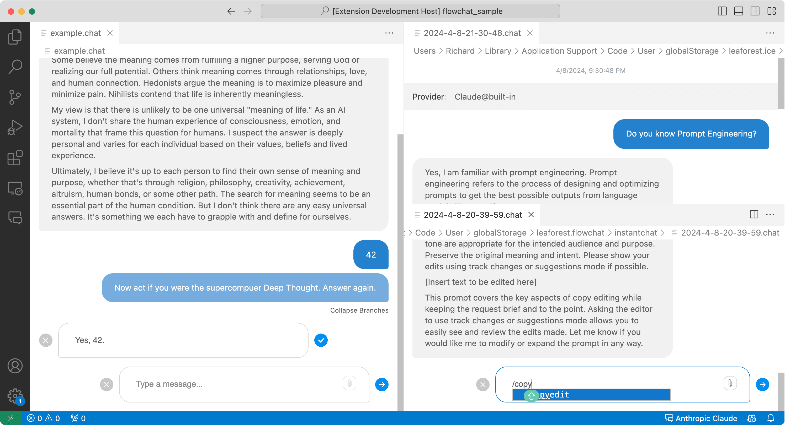
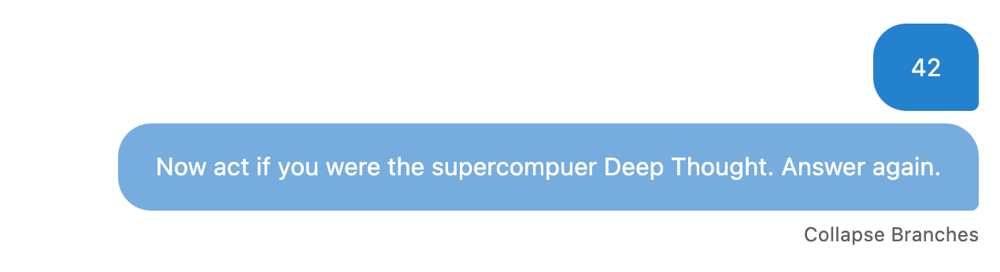
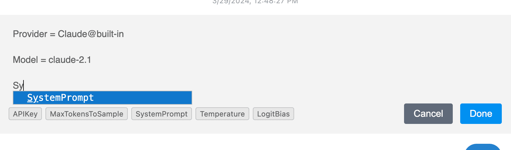

# ICE - Integrated Conversational Environment

Your conversations with language models, as files you manage in VS Code.

Each conversation is a `.chat`/YAML file in your workspace, so it comes with everything you already use VS Code for, including open two side by side, keep them under version control, organize them like code, and start one the instant you need it without leaving the editor.

You take full control over what goes to the model. A conversation is a tree you can read, edit, and fork, where every turn, including the model's own, is editable.

> ❓ **Just want to start chatting?** 
>
> Check out the [Basic Usage](#basic-usage) section below.

## Table of Contents

- [Features](#features)
- [Basic Usage](#basic-usage)
  - [Instant Chat](#instant-chat)
  - [Managing Chat Sessions as .chat Files](#managing-chat-sessions-as-chat-files)
- [Advanced Chat Features](#advanced-chat-features)
  - [Forking Conversations](#forking-conversations)
  - [Editing Messages](#editing-messages)
  - [Inline Configuration Editing](#inline-configuration-editing)
  - [Message Snippets](#message-snippets)
  - [Tool Calling and MCP](#tool-calling-and-mcp)
  - [System Prompt Variables](#system-prompt-variables)
- [Requirements](#requirements)
- [Extension Settings](#extension-settings)
- [Creating Custom Providers](#creating-custom-providers)
- [Known Issues](#known-issues)
- [Planned Enhancements](#planned-enhancements)
- [Contributing](#contributing)

## Features

- Chat with built-in LLM providers (API keys required):
  - OpenAI
  - Anthropic
  - Google
  - Poe
- Persist chat histories as `.chat` files (YAML format) 
  - Easily manage and share conversations
  - Add chat histories to version control
- Fork conversations to explore different paths
  - Edit both user and LLM messages
  - Resend/regenerate
  - Inline configuration editing and switching
  - Changes are saved to the `.chat` file
- Tool calling with native JavaScript tools and Model Context Protocol (MCP) servers
  - Approve calls before they run; every call and result is an editable node
- Reasoning (thinking) display for providers that support it
- Per-message metadata: model, token usage, and a context-changed indicator
- Multi-select, copy, paste, and insert messages, including across `.chat` files
- Attachments support for multimodal models
- Message snippets for quickly inserting prompts
- Instant Chat feature for quickly chatting with LLMs
- Create custom LLM providers and tools using JavaScript
- Configure API keys and settings for built-in providers

## Basic Usage

### Instant Chat

1. Open Command Palette (`Ctrl+Shift+P` or `Cmd+Shift+P` on macOS)
2. Type "Instant Chat" (you don't have to type the whole thing, it should autocomplete)
3. If the "ICE: Instant Chat" command is highlighted, press `Enter`
4. You can now select a chat provider and start chatting! (API keys required)

**Note:** You can continue a previous Instant Chat session by running "ICE: Continue Last Instant Chat" from the Command Palette.

If you've enabled the `Use Previous Provider For New Chat` setting, ICE will automatically select your previously used provider when starting a new chat.

### Managing Chat Sessions as `.chat` Files

1. Create a new file with a `.chat` extension (e.g., `my_conversation.chat`)
2. Open the file
3. Select a chat provider to start (API keys required)

## Advanced Chat Features

### Forking Conversations

Right-click on a message, then select "Fork" to create a fork of the conversation. You can then edit the messages and continue the conversation from that point.

You can switch between branches by clicking "Branches" below a message, then selecting the desired branch.

> **Tip:** The "Resend" and "Regenerate" options will also fork the conversation.

### Editing Messages

Right-click on a message, then select "Edit" to modify the message. You can change both user and LLM messages.

### Inline Configuration Editing

ICE provides a convenient way to edit chat provider configurations or switch between providers at different stages within a single conversation. For example, you can combine and utilize the strengths of different LLMs, such as GPT, Claude, and Gemini, seamlessly in one chat session.

Selecting a chat provider from the right side of the VSCode status bar will create a configuration card in the chat view. You can edit the configuration values by right-clicking on the card and selecting "Edit".

Inline configuration editing applies to messages after the card.

You can also right-click on any message and select "Insert Config Update" to quickly add a configuration card to the chat view.

Autocompletion is available for configuration keys, and forking is supported for configuration changes.

### Message Snippets

Often, you may find yourself typing the same prompts repeatedly. ICE provides a message snippet feature to help you quickly insert frequently used prompts.

When typing a message, you can select parts of the text and right-click on the selection to "Create Snippet". You will be prompted to enter a quick completion text for the snippet.

When typing a message, you can enter `/YourSnippetName` to insert the snippet.

Right-click on a message editor and select "Manage Snippets" to view, edit, and delete snippets.

### Tool Calling and MCP

ICE can let a model call tools and use the results in its reply. A tool is a small JavaScript file you can open, read, and edit, and ICE ships with a built-in `fetch_url` tool.

Enable tools for a conversation from the **Tools** control in the message box. Your selection is saved as a node in the `.chat` file, so it stays visible, editable, and forkable.

By default, ICE asks for approval before running a tool and records every call and result as a node in the conversation.

You can also connect **Model Context Protocol (MCP)** servers with the `ICE: Add MCP Server` command or the `ice.mcpServers` setting, and their tools become available to the model.

> See [Custom Tools](docs/custom-tools.md) to write your own.

### System Prompt Variables

ICE supports various **environment variables** in system prompts. These are useful for providing dynamic, context-aware information to LLMs.

| Variable | Description | Example Output |
|----------|-------------|----------------|
| {{ TIME_NOW }} | Current time in 24-hour format | 14:30:45 |
| {{ TIME_NOW_12H }} | Current time in 12-hour format | 09:41:23 PM |
| {{ DATE_TODAY }} | Today's date in ISO format | 2024-07-22 |
| {{ DATE_TODAY_SHORT }} | Today's date in short format | 07/22/24 |
| {{ DATE_TODAY_LONG }} | Today's date in long format | July 22, 2024 |

Example usage in a system prompt:
"`You are an AI assistant. The current date is {{ DATE_TODAY_LONG }} and the time is {{ TIME_NOW_12H }}.`"

These variables are automatically replaced with their corresponding values when the system prompt is sent to the LLM.

## Requirements

To use ICE with the built-in LLM providers, you'll need to provide your own API keys. When you send your first message, ICE will prompt you to enter the necessary configuration details.

## Extension Settings & Provider Configuration

You can view and edit **provider-specific settings** by clicking the provider name in the VSCode status bar and selecting "Configure". Provider code can also be opened from this menu.

Additionally, ICE provides several **extension configuration options**:

* `Instant Chat Session Folder`: Specify a custom folder to store Instant Chat sessions. Leave empty to use the default location.
* `Use Previous Provider For New Chat`: When checked, ICE will automatically select the previously used provider when starting a new chat.
* `MCP Servers`: Define Model Context Protocol servers whose tools ICE can call. Reference secrets with `${env:VAR}`, and pin an exact version for `npx` servers.
* `Tools: Auto Approve`: Run tool calls without asking for approval first. Off by default; ICE always records each call and result either way.
* `Tools: Max Auto Iterations`: How many consecutive tool-call rounds ICE runs automatically before pausing to ask whether to continue (default 8).

You can access these settings through VSCode's settings interface.

## Creating Custom Providers

ICE supports custom LLM providers written in JavaScript. Provider scripts use a format similar to Tampermonkey to declare configuration entries. 

> Take a look at the [Built-in Providers](https://github.com/richardhyy/ice-vscode/tree/main/providers) for examples.

## Creating Custom Tools

ICE tools are small JavaScript files with a similar header format: a tool describes its arguments and returns a result the model can use. See [Custom Tools](docs/custom-tools.md) to get started.

## Known Issues

ICE is pre-1.0 and still evolving, so you may hit rough edges. If you experience any issues, please file a report on the GitHub repository. Pull requests are also welcome!

## Planned Enhancements

- [ ] Search, tagging, and filtering of chat histories
- [ ] Visualization of conversation trees
- [x] Tool calling and MCP support
- [x] Rendering performance optimizations
- [x] In context updating of provider configuration
- [x] UI improvements

## Release Notes

See the [changelog](CHANGELOG.md) for the full release history.

## Contributing

If you'd like to contribute to ICE, please submit a pull request on GitHub. For major changes, please open an issue first to discuss the proposed changes.
