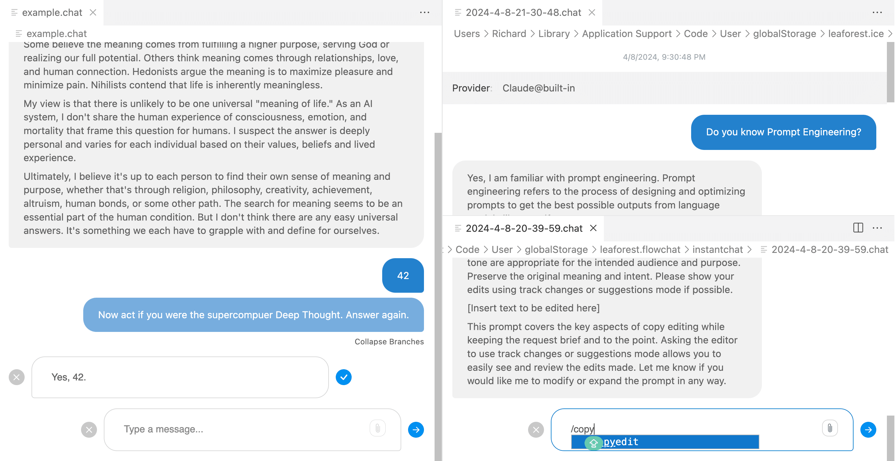

# ICE

> **Integrated Conversational Environment** for VSCode

- Manage conversations as **editable, tree-structured .chat files**
- **Fork messages** to reduce bias and explore different paths
- Message **snippets** for quick prompt insertion
- Inline LLM **parameter editing**
- Free and open-source

[VSCode Marketplace](https://marketplace.visualstudio.com/items?itemName=LeaForest.integrated-conversational-environment)
[Learn More](#main)

<!-- background image -->

