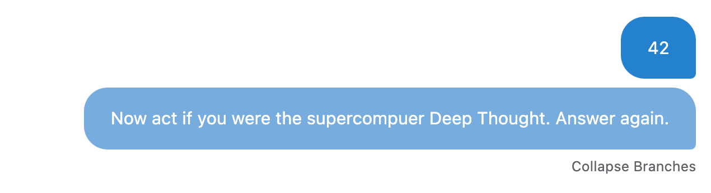
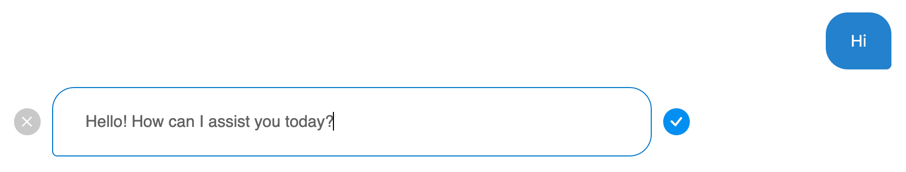

# Forking and Editing

ICE provides powerful tools for exploring different conversation paths and refining your interactions with LLMs.

## Forking Conversations

1. Right-click on any message in the chat.
2. Select "Duplicate" to create a new branch from that point.
3. Continue the conversation in the new branch.

## Switching Branches

- Click "Branches" below a message to view available branches.
- Select a branch to switch to that conversation path.

## Editing Messages

1. Right-click on any message (user or AI).
2. Select "Edit" to modify the message content.
3. Make your changes and save.

## Regenerating Responses

- Right-click on an AI message and select "Regenerate" to get a new response.
- This automatically creates a new branch.

## Benefits

- Explore multiple conversation directions
- Refine prompts for better AI responses
- Correct mistakes or update information in past messages
