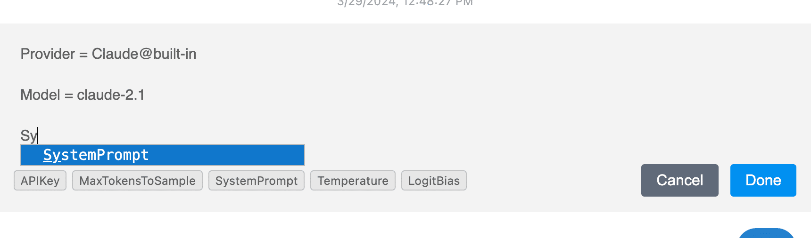

# Inline Configuration

ICE allows you to modify chat provider settings and switch between providers within a single conversation.

## Adding Configuration

1. Click the provider name in the VSCode status bar.
2. Select "Insert Configuration" to add a configuration card to the chat.

## Editing Configuration

1. Right-click on a configuration card.
2. Select "Edit" to modify the settings.

## Configuration Scope

- Changes apply to all messages after the configuration card.
- You can have multiple configuration changes in one conversation.

## Use Cases

- Switch between different LLM providers/models mid-conversation
- Adjust model parameters (temperature, max tokens, system prompts, etc.)
- Use different API keys for different parts of the conversation

## Tips

- Use autocomplete for configuration keys
- Configuration changes also support forking
