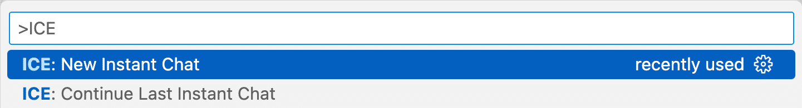

# Instant Chat

Instant Chat allows you to quickly start conversations with LLMs without creating a new `.chat` file.

## Starting an Instant Chat

1. Open the Command Palette (Ctrl+Shift+P or Cmd+Shift+P).
2. Type "New Instant Chat" and select `ICE: New Instant Chat`.
3. Choose your preferred chat provider.

## Continuing Previous Sessions

- Use "ICE: Continue Last Instant Chat" from the Command Palette.

## Session Storage

- Instant Chat sessions are automatically saved.
- Find them in the configured Instant Chat Session Folder.

## Configuration

- Set a custom folder for Instant Chat sessions in ICE settings.
- Enable "Use Previous Provider For New Chat" for quicker starts.

## Benefits

- Rapid access to LLM capabilities
- No need to manage individual chat files for quick queries
- Seamless continuation of previous conversations

## Tips

- You may want to bind a keyboard shortcut to "ICE: New Instant Chat" for quicker access (click the gear icon in the Command Palette).
- You don't have to type the full command; it should autocomplete after typing "ICE".
