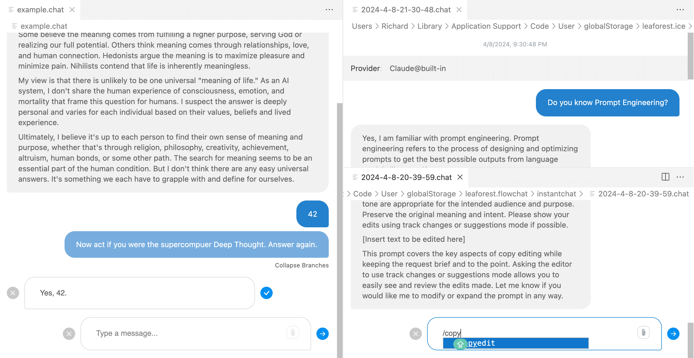

# ICE

> VSCode用の**統合対話環境**（Integrated Conversational Environment）

- 会話を**編集可能なツリー構造の.chatファイル**として管理
- バイアスを減らし、異なる方向性を探るための**メッセージのフォーク**機能
- クイックプロンプト挿入のための**メッセージスニペット**
- インラインでのLLM**パラメータ編集**
- 無料でオープンソース

[VSCodeマーケットプレイス](https://marketplace.visualstudio.com/items?itemName=LeaForest.integrated-conversational-environment)
[詳細を見る](#main)

<!-- background image -->

