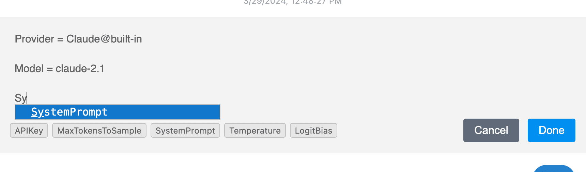

# インライン設定

ICEでは、1つの会話内でチャットプロバイダーの設定を変更し、プロバイダー間を切り替えることができます。

## 設定の追加

1. VSCodeのステータスバーでプロバイダー名をクリックします。
2. 「設定を挿入」を選択して、チャットに設定カードを追加します。

## 設定の編集

1. 設定カードを右クリックします。
2. 「編集」を選択して設定を変更します。

## 設定のスコープ

- 変更は設定カードの後のすべてのメッセージに適用されます。
- 1つの会話内で複数の設定変更を行うことができます。

## ユースケース

- 会話の途中で異なるLLMプロバイダー/モデルを切り替える
- モデルのパラメータ（温度、最大トークン数、システムプロンプトなど）を調整する
- 会話の異なる部分で異なるAPIキーを使用する

## ヒント

- 設定キーにはオートコンプリートを使用できます
- 設定の変更もフォーク機能をサポートしています
