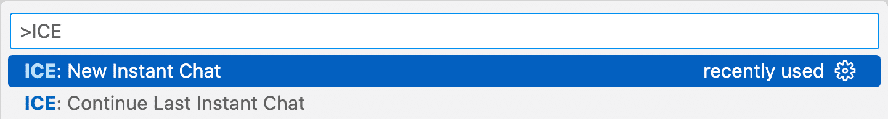

# インスタントチャット

インスタントチャットを使用すると、新しい`.chat`ファイルを作成せずに、LLMとの会話をすぐに開始できます。

## インスタントチャットの開始方法

1. コマンドパレットを開きます（Ctrl+Shift+PまたはCmd+Shift+P）。
2. "New Instant Chat"と入力し、`ICE: New Instant Chat`を選択します。
3. 好みのチャットプロバイダーを選択します。

## 以前のセッションの続行

- コマンドパレットから"ICE: Continue Last Instant Chat"を使用します。

## セッションの保存

- インスタントチャットセッションは自動的に保存されます。
- 設定されたインスタントチャットセッションフォルダで見つけることができます。

## 設定

- ICE設定でインスタントチャットセッション用のカスタムフォルダを設定できます。
- より迅速な開始のために"Use Previous Provider For New Chat"を有効にできます。

## メリット

- LLM機能への迅速なアクセス
- 簡単な質問のために個別のチャットファイルを管理する必要がない
- 以前の会話をシームレスに継続可能

## ヒント

- より迅速にアクセスするために、"ICE: New Instant Chat"にキーボードショートカットを割り当てることをお勧めします（コマンドパレットの歯車アイコンをクリックしてください）。
- コマンド全体を入力する必要はありません。"ICE"と入力した後に自動補完されるはずです。
