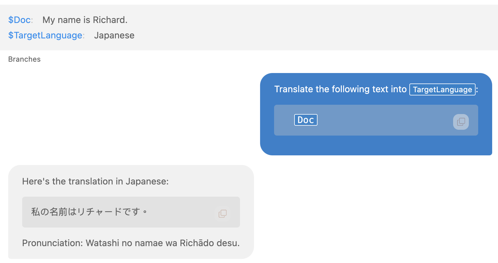

# Variables and Placeholders

ICE provides powerful functionality through the use of variables and placeholders in both user messages/prompts and system prompts. This feature allows for more dynamic and context-aware interactions with LLMs.

## User Messages and Prompts

You can use custom variables in your user messages and prompts to create more flexible and reusable content. Here's how to use this feature:

### Declaring Variables

1. Right-click on a message in the chat view and select "Insert Config Update".
2. In the configuration editor, declare variables using the format:
   ```
   $variableName = Variable value...
   ```
3. You can declare multiple variables in a single configuration update.

### Using Variables

Once declared, you can use these variables in your messages:

1. In user messages, insert variable placeholders by typing `{{ variableName }}`.
2. ICE provides autocompletion for quick insertion of variable names.

### Example

Configuration update:
```
$Doc = My name is Richard.
$TargetLanguage = Japanese.
```

User message:
```
Translate "{{ Doc }}" to {{ TargetLanguage }}.
```

This will be expanded to:
```
Translate "My name is Richard." to Japanese.
```



## System Prompts

For system prompts, ICE supports various built-in environment variables. These are particularly useful for providing context-aware information to LLMs without needing to manually update the information.

### Available Environment Variables

| Variable | Description | Example Output |
|----------|-------------|----------------|
| {{ TIME_NOW }} | Current time in 24-hour format | 14:30:45 |
| {{ TIME_NOW_12H }} | Current time in 12-hour format | 09:41:23 PM |
| {{ DATE_TODAY }} | Today's date in ISO format | 2024-07-22 |
| {{ DATE_TODAY_SHORT }} | Today's date in short format | 07/22/24 |
| {{ DATE_TODAY_LONG }} | Today's date in long format | July 22, 2024 |

### Using Environment Variables

You can include these variables directly in your system prompts. They will be automatically replaced with their corresponding values when the system prompt is sent to the LLM.

Example usage in a system prompt:
```
You are an AI assistant. The current date is {{ DATE_TODAY_LONG }} and the time is {{ TIME_NOW_12H }}.
```

This might be expanded to:
```
You are an AI assistant. The current date is July 22, 2024 and the time is 09:41:23 PM.
```

## Best Practices

1. **Consistent Naming**: Use clear and consistent naming conventions for your variables to make them easy to understand and use.

